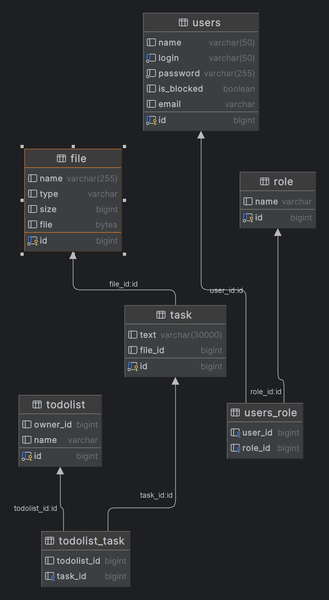

# Task Tracker
1.	РЕГИСТРАЦИИ НОВОГО ПОЛЬЗОВАТЕЛЯ
2.	АВТОРИЗАЦИЯ ПОЛЬЗОВАТЕЛЯ
3.	ВОЗМОЖНОСТЬ ДОБАВЛЕНИЯ, ПРОСМОТРА, ИЗМЕНЕНИЯ, УДАЛЕНИЯ ЗАДАЧИ В TO-DO LIST
4.	ВОЗМОЖНОСТЬ ПРИКРИПЛЕНИЕ ФАЙЛОВ К ЗАДАЧАМ.

## Используемые технологии
- Java 11
- spring boot web mvc, jpa, security
- lombok
- docker
- maven

### Схема БД 

#### Сборка проекта и запуск
происходит через команду docker compose up